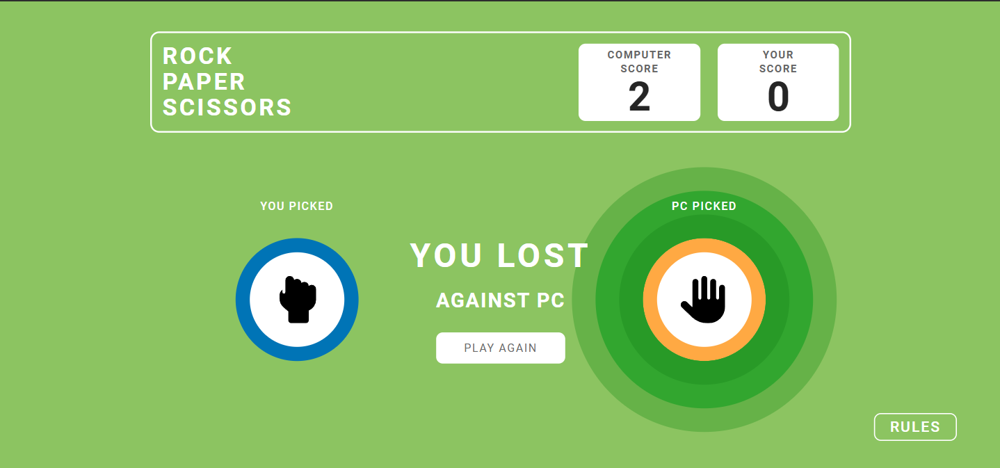

# Rock Paper Scissors Game

A simple Rock Paper Scissors game built using HTML, CSS, and JavaScript. This web application is designed to be desktop responsive, providing an interactive and enjoyable gaming experience.

## Features

- **Classic Gameplay**: Play the traditional Rock Paper Scissors game.
- **Responsive Design**: Optimized for desktop screens.
- **Interactive UI**: Engaging animations and user-friendly interface.

## Technologies Used

- **HTML**: Structure of the web application.
- **CSS**: Styling and animations for an attractive design.
- **JavaScript**: Game logic and interactivity.

## How to Play

1. Open the web application in your browser.
2. Choose your move: Rock, Paper, or Scissors.
3. The computer will randomly select its move.
4. The winner is determined based on the following rules:
   - Rock beats Scissors.
   - Scissors beat Paper.
   - Paper beats Rock.
5. The result (Win, Lose, or Draw) will be displayed.

## Installation

1. Clone the repository or download the ZIP file:
   ```bash
   git clone https://github.com/Priyanshu15092001/Rock-Paper-Scissors-Game.git
   ```
2. Open the `index.html` file in your preferred browser.

## Demo

[Live Demo](https://priyanshu15092001.github.io/Rock-Paper-Scissors-Game/)  

## Screenshot





## Folder Structure

```
rock-paper-scissors/
├── index.html
├── style.css
├── script.js
├── assets/images/
└── README.md
```

## Future Improvements

- Add support for mobile responsiveness.
- Include sound effects for better user engagement.
- Implement a multiplayer system to play online with friends.

## Acknowledgments

- Inspired by the classic Rock Paper Scissors game.
- Thanks to [Figma Design Reference](https://www.figma.com/design/PcJKaVsqoRk8g9xKdD3DQu/Cuvette-Task?node-id=0-1&p=f&t=JzkZh6tPD67qbSy5-0)
